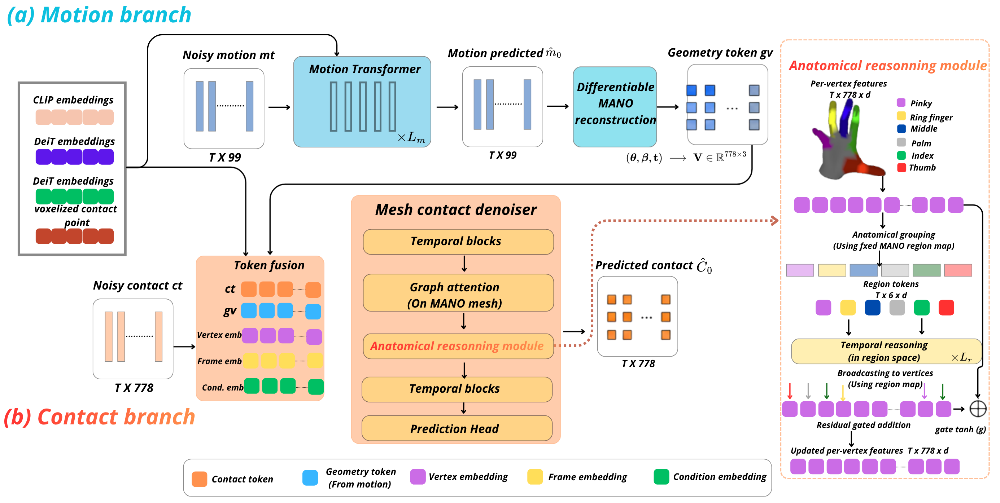

# DisContact: Joint Hand Motion and Contact Map Synthesis with a Hybrid Diffusion Model


DisContact generates 3D hand motion and per-vertex contact maps **jointly**, from a
single image, an action text and a 3D contact point. Motion is modelled with a
Gaussian DDPM in 6D rotation space; contact is modelled with a per-vertex Bernoulli
D3PM over the 778 MANO vertices, structured by the MANO mesh graph.


<p align="center">
  
</p>

## Setup

```bash
conda create --name discontact python=3.10
conda activate discontact

conda install pytorch==2.4.1 torchvision==0.19.1 torchaudio==2.4.1 pytorch-cuda=12.4 -c pytorch -c nvidia
conda install -c fvcore -c iopath -c conda-forge fvcore iopath
conda install -c bottler nvidiacub

conda env update --file env.yml
```

The codebase also requires the MANO model. Please visit the
[MANO website](https://mano.is.tue.mpg.de) and register to get access to the
downloads section. Since we only consider the right hand, `MANO_RIGHT.pkl` is
sufficient.

Set the environment variables:

```bash
export ROOT_DIR=<path_to_repo>
export MANO_PATH=<path_to_mano_models>
```

Both are required. If `MANO_PATH` is unset, forward kinematics is disabled and the
`l_motion_pos` loss and the geometry token are silently turned off — check the
sanity block printed at startup.

## Data

We use publicly released annotations extracted with the data engine of prior work
on 3D hand-object interaction synthesis (see the paper for the reference). The
`downloads` folder contains:

```
├── downloads
│   ├── holo_contact_dir
│   ├── holo_video_feats
│   ├── holo_video_inpaint_feats
│   ├── holo_settings_data_precomputed
│   ├── arctic_contact_dir
│   ├── arctic_video_feats
│   ├── arctic_data_precomputed
```

Place them under `$ROOT_DIR/downloads/`.

We follow the same four generalization settings, selected with `--setting`:
`categories` (object-level), `tasks` (task-level), `actions` (action-level),
`instances` (scene-level). ARCTIC has no setting split — omit `--setting` and pass
`--dataset_name arctic`.

## Step 1 — Precompute the MANO mesh structures

**Run this once, before any training.** It writes three files to `$ROOT_DIR`:

```bash
python mano_graph.py --viz
```

| File | Shape | Used for |
|---|---|---|
| `mano_edge_index.pt` | `(2, 4630)` | sparse attention restricted to MANO mesh edges |
| `mano_edge_features.pt` | `(4630, 8)` | static FiLM edge bias (distance + region info) |
| `mano_region_map.pt` | `(778,)` |  anatomical reasoning module and region-density loss |

Regions are derived from the MANO skinning weights: each vertex is assigned to the
joint that influences it most, giving 6 anatomical regions (palm, index, middle,
ring, little, thumb). `--viz` saves `mano_regions.png` to check the assignment.

These files change the architecture. If `mano_edge_features.pt` is missing,
`edge_feat_dim` drops to 0 and the FiLM layers are not built; if
`mano_region_map.pt` is missing, the region bottleneck and the region loss are
disabled. Both happen without an error, and a checkpoint trained with them will
then fail to resume.

## Step 2 — Training

Single stage, end to end — no codebook, no indexer:

```bash
CUDA_VISIBLE_DEVICES=0 python train_diffusion.py \
    --name discontact_tasks --setting tasks --make_video --no_wandb
```

Change `--setting` to `categories`, `actions` or `instances` for the other three
generalization settings. The four runs reported in the paper:

```bash
for s in categories tasks actions instances; do
  CUDA_VISIBLE_DEVICES=0 python train_diffusion.py \
      --name discontact_$s --setting $s --make_video --no_wandb
done
```

On ARCTIC:

```bash
CUDA_VISIBLE_DEVICES=0 python train_diffusion.py \
    --name discontact_arctic --dataset_name arctic --make_video --no_wandb
```

All arguments live in `options/discontact_option.py`, grouped by role (`run`,
`model`, `mesh`, `diffusion`, `data`, `loss`, `optim`, `logging`); see
`python train_diffusion.py --help`. Each run writes its resolved arguments to
`logs/<dataset>/<name>/opt.txt`, and the per-vertex contact marginals to
`logs/<dataset>/<name>/vertex_marginals.pt`.

Validation runs at three levels: the training objective at a random timestep, full
conditional sampling with MPJPE and contact F1, and unconditional sampling as a
generation sanity check.

Resume with `--is_continue`. The architecture flags must match the original run,
otherwise the checkpoint loads only partially.

## Step 3 — Demo

Single image plus action text, end to end. The 3D contact point is localized
automatically (open-vocabulary detection for the object, monocular metric depth for
the unprojection):

```bash
python demonstration.py \
    --img ./demo/examples/00300.jpg \
    --text "open cap" \
    --ckpt ./logs/holo/discontact_tasks/model/finest.tar \
    --vertex_marginals_path logs/holo/discontact_tasks/vertex_marginals.pt \
    --n_frames 30 --T_diff_steps 1000
```

Pass `--point u v` to set the contact pixel manually and bypass detection.
Architecture defaults are shared with training, so no architecture flags are needed.
Always pass `--vertex_marginals_path`: without it the model falls back to a uniform
prior of 0.05 and the generated contact density is wrong.

Outputs are written to `--save_dir`: posed renders over the input image, an
alternate viewpoint, flat-hand contact maps, checkerboard videos, and an
interactive plotly animation.


Pretrained checkpoints: <!-- TODO: anonymous file host, not a personal drive -->

## Tests

```bash
python eval.py --device cuda --save_plots
```

Checks the noising endpoints, schedule calibration, per-vertex marginals,
reverse-chain stability and the variational bound.


## License

<!-- TODO before de-anonymization: the codebase this builds on is released under
     CC BY-NC 4.0, which constrains derivative works. Confirm the terms. -->


## Acknowledgements

This repo builds on top of publicly available codebases. We thank the authors for
making their code available. Please check their respective repos for citation,
licensing and usage.

- [LatentAct](https://github.com/ap229997/LatentAct) — data engine annotations and evaluation protocol
- [MoMask](https://github.com/EricGuo5513/momask-codes) — training framework
- [DiGress](https://github.com/cvignac/DiGress) — discrete diffusion and graph transformer
- [MDM](https://github.com/GuyTevet/motion-diffusion-model)
- [UniDepth](https://github.com/lpiccinelli-eth/UniDepth)
- [MANO](https://mano.is.tue.mpg.de) · [HoloAssist](https://holoassist.github.io) · [ARCTIC](https://arctic.is.tue.mpg.de)
